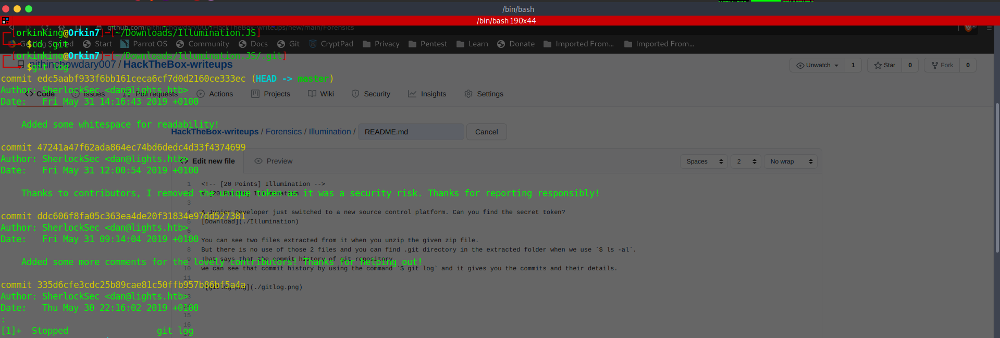

<!-- [20 Points] Illumination -->
# [20 Points] Illumination

A Junior Developer just switched to a new source control platform. Can you find the secret token?
[Download](./Illumination)

You can see two files extracted from it when you unzip the given zip file.
But there is no use of those 2 files and you can find .git directory in the extracted folder when we use `$ ls -al`.
That says that the commit history of git repository.
we can see that commit history by using the command `$ git log` and it gives you the commits and their details.



When we look into that log history. There's a commit saying that `Thanks to contributors, I removed the unique token as it was a security risk. Thanks for reporting responsibly!`

Now we can use `git show` command to see full details about that commit.
```
$ git show 47241a47f62ada864ec74bd6dedc4d33f4374699
```
this shows that `SFRCe3YzcnNpMG5fYzBudHIwbF9hbV9JX3JpZ2h0P30=` is the required tocken 

By the looks we can say that it is in Base64 format.
```
$ echo SFRCe3YzcnNpMG5fYzBudHIwbF9hbV9JX3JpZ2h0P30= | base64 -d
```
This gives us the flag.

<!-- Flag: -->
## Flag:
```
HTB{v3rsi0n_c0ntr0l_am_I_right?}
```
