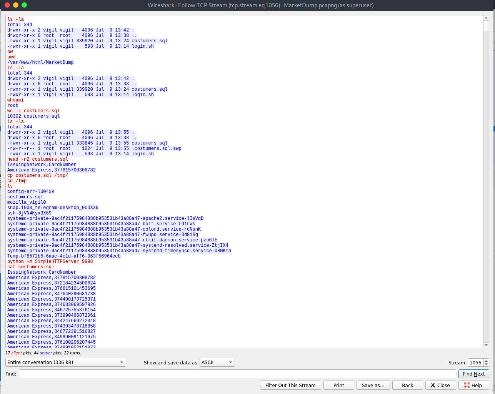
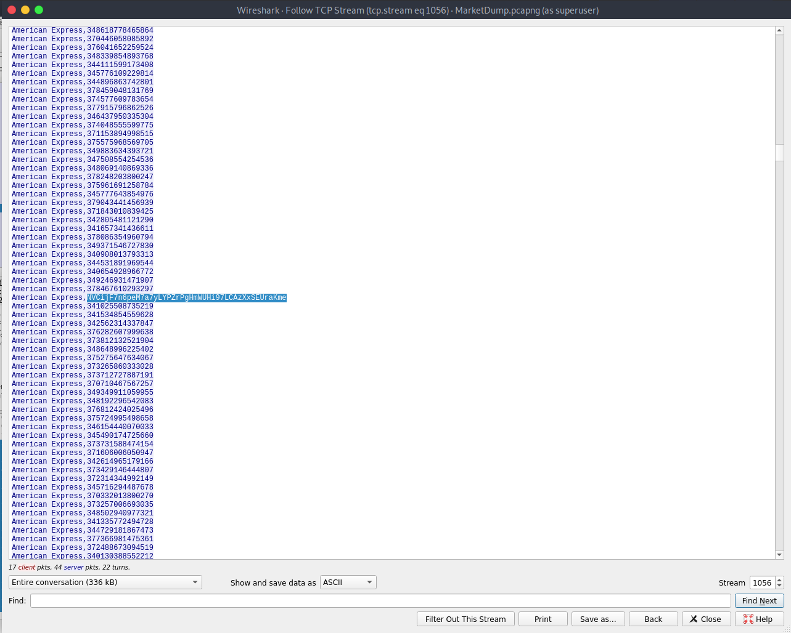

<!-- [30 Points] MarketDump -->
# [30 Points] MarketDump 

We have got informed that a hacker managed to get into our internal network after pivoiting through the web platform that runs in public internet.
He managed to bypass our small product stocks logging platform and then he got our costumer database file. We believe that only one of our costumers was targeted. 
Can you find out who the customer was?

[Download](./MarketDump.zip)

Zip Password: hackthebox sha256: d0ed5b6cc06bcb191fc0d83195542f7c1276835b1d8e2c5508e907ba740b64f6

<!-- Exploit: -->
## Exploit:

we get a pcapng on unziping the given zip file.
Open that in wireshark.
Follow the TCP streams and you can find exfiltration data in streame 1056



And when we scroll down, we can find an encrypted msg.



put this message in magic recipe of codechef. we'll get the flag.

<!-- Flag: -->
## Flag:
```
HTB{DonTRuNAsRoOt!MESsEdUpMarket}
```
