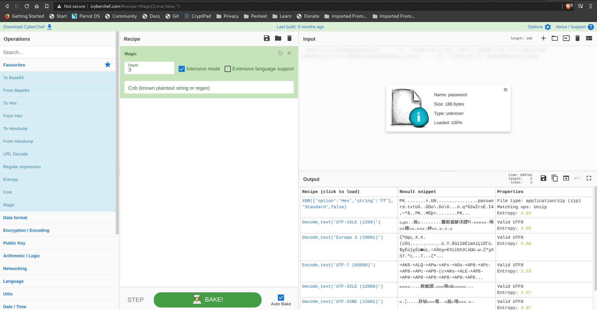

<!-- [20 Points] Took the Byte -->
# [20 Points] Took the Byte

Someone took my bytes! Can you recover my password for me?

[Download](./Took_the_Byte.zip)  
Zip Password: hackthebox sha256: ee86f6c49a6c7e8adc09f03efd21825e3d4b5e5058e733e5cc3c9f69826c59a4

<!-- Exploit: -->
## Exploit:

Extract the file from the given zip file. It contains some data.[password](./password)

From the name of the challenge TooktheByte we can sort of understand that it something related to byte shift i.e XOR operation
so we can use [cyberchef](http://icyberchef.com/) tool

use magic recipe in intensive mode on the file [password](./password).


Select the Xor operation.
save the output. we'll get a zip file and when you unzip it, we'll get a textfile with flag.

<!-- Flag: -->
## Flag:
```
HTB{27AjFDkqi1wJ}
```
