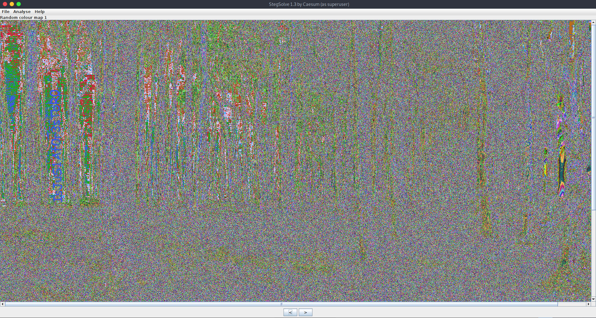

<!-- [40 Points] Forest -->
# [40 Points] Forest

Explore the forest and capture the flag!

[Download](./Forest.zip)  
Zip Password: hackthebox sha256: 7dd20fb1f8b0094486b7ed571bc32bfa8a33cb5b18237585ecbb78e362821e0b

<!-- Exploit: -->
## Exploit:

Given zip file contains jpg image [forest.jpg](./forest.jpg).
If you see it properly, we can find something writen on it. but not properly visible visible 

So,we can use stegsolve tool to analyse image in different planes by taking off bits of the image.
```
$ java -jar stegsolve.jar
```
while changeing the planes we can find some text written on it



Text: IsJuS1Af0r3sTbR0

I've tried this as flag! But it doesnt work. :(

Use Steghide with `IsJuS1Af0r3sTbR0` as passphrase...
```
$ steghide --extract -sf forest.jpg -p IsJuS1Af0r3sTbR0
```
And it'll give us a text file [nothinghere.txt](./nothinghere.txt)

In this file we can find `UGO{NzNm1aTfXvyYmMOe0}` at the end of the text.

Looking at it we can say that it was encrypter using caeser cipher of shift 13.

by decodeing it we get the flag.

<!-- Flag: -->
## Flag:
```
HTB{AmAz1nGsKilLzZBr0}
```


