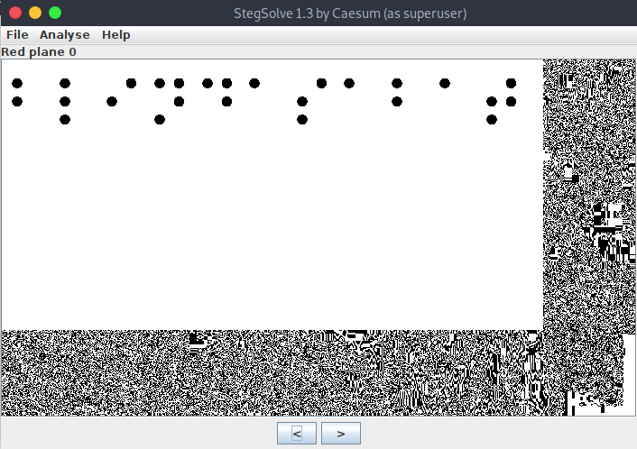

<!-- [50 Points] Senseless Behaviour -->
# [50 Points] Senseless Behaviour

John is practicing his steganography skills but don't let the space kittens affect what you see... There is more than one way to uncover hidden secrets.

Zip Password: hackthebox sha256: 0203f0830bfa1cbbefc79686b66e28e751876be0838f988e53079a3b3d9c0fbb

<!-- Exploit -->
## Exploit:

Extract the meow.wav file from the given zip file.

Bootforce the given meow.wav file using stegcracker and rockyou.txt.
```
$ stegcracker meow.wav rockyou.txt
```
 It will give us a text file as an output [meow.wav.out](./meow.wav.out)
  By decoding that text file using base64 formate it give some numbers which looks like hexadecimals which when decoded to text gives us some text which specifies that [meow.wav.out](./meow.wav.out) is some PNG file.
  
So using this commands gives us the png image. [image.png](./image.png)
```
cat meow_flag.txt | base64 -d | xxd -r -p > image.png
```

Now use stegsolve tool to analyse the image which shows something hidden in image in brilie script.



decode that and you'll get the flag.

<!-- Flag: -->
## Flag:
```
HTB{blindasabat}
```


